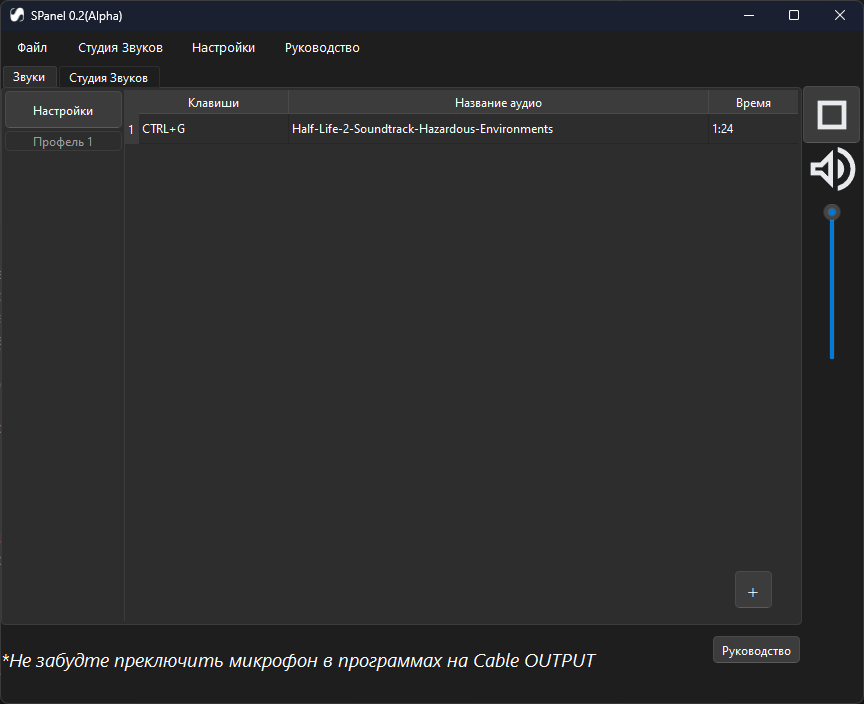
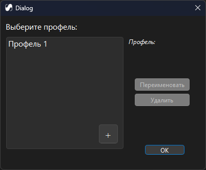
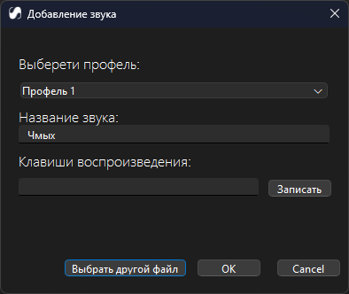
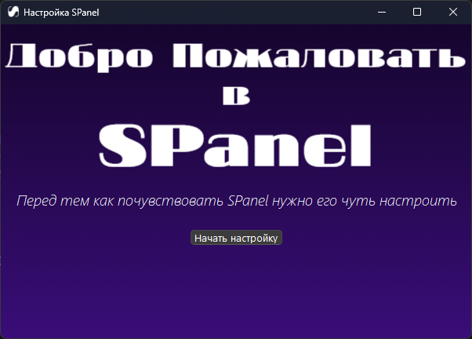
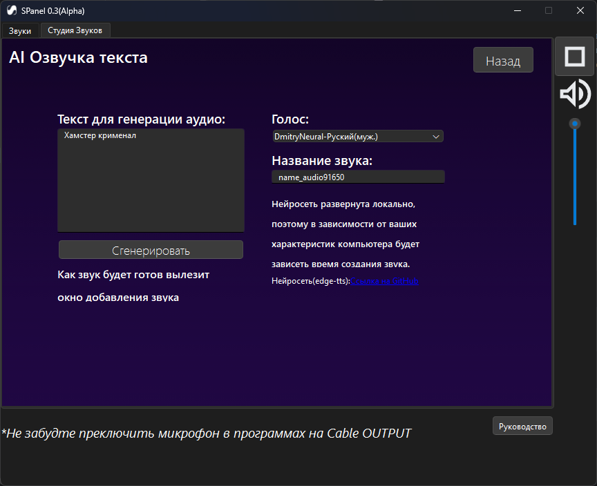

# Spanel
<div align=center>
 	
</div>

## [Cкачать exe файл📝](https://github.com/Roman4404/spanel/wiki/Download)
Автор идеи: https://github.com/Roman4404
Описание: SPanel - это приложение, которое дает вам  воспроизведение аудио в голосовых чатах (используется цифровое преобразование) с помощью вашего микрофона.
Цель и задачи: Разнообразить общение в голосовых чатах и стримов. Для музыкантов и диджеев воспроизведение заранее заготовленных аудио.
## Как запустить проект
0. Проверить что версия python 3.9 < версия python < 3.13 
1. Клонируйте репозиторий
```shell
git clone https://github.com/Roman4404/spanel.git
```
2. Перейдите в папку проекта
```shell
cd ./spanel/
```
3.Создайте и активируйте виртуальное окружение
```shell
python -m venv venv
venv\Scripts\activate.bat
```
4.Установите необходимые библиотеки
```shell
pip install -r requirements.txt
```
5.Запустите Initial_setup_main.py
```shell
python .\Initial_setup_main.py
```
6.Запустите main.py
```shell
python .\main.py
```

## Как пользоваться

Всё подробно описано здесь:[Spanel Wiki](https://github.com/Roman4404/spanel/wiki)

### Как добавить звук
1) Нажмите на "+" во вкладке "Звуки"
2) По указания программы

## Структура:
```
│   main.py #Программа
│   requirements.txt
│   README.md
│ 
├───mainWindows #Отвечает за интерфейс и данные │  программы 
│       │
│       ├───date #Папка с данными
│       │   │   profile_info.sqlite #БД 
│       │   │   settings_app.txt #Настройки приложения
│       │   │   settings_profile.txt #Информация об профилях
│       │   │   
│       │   └───sound_vaults #Папка с скопированным аудио
│       │           test.wav #Аудио
│       │           
│   	└───Interface #Интерфейс
│   	    │   final_add_sound.ui #Окно добавлия аудио
│   	    │   New_base.ui #Окно главной страницы
│   	    │   profile_settings.ui #Окно настроек профилей
│   	    │   record_hot_key.ui #Окно записи клавиш
│   	    │   
│   	    └───image #Картинки нужные интерфейсу(значки, т.д)
│   
│           
├───Initial_Setup_Windows #Программа установщик       
|  │   Initial_setup_main.py #Программа установщик
|  │   
|  └───Interface #Интерфейс
|      │   Base.ui #Окно установщика
|      │   stage_1_sitings_microfon.ui #Окно 1 стадии
|      │   stage_2_waiting_driver.ui #Окно 2 стадии
|      │   stage_wait.ui #Финальная стадия
|      │   
|      └───image #Картинки нужные интерфейсу(значки, и т.д)
│           
└───pyt
```
## Технология:
```
Ввод данных с микрофона 
 │   
\/
Виртуальный микрофон обработчик(Идет смешивания аудио с микрофона и записи)
 │   
\/
Вывод в виртуальный микрофон для вывода
```

Все это реализуется с помощью VB-Cable

P.S: В будущем технология будет улучшена
 
## Основные классы в main.py:​
```
WorkToSoundFile(Работает с аудио)​
WorkToHotKey(Работает с горячими клавишами)​
Interface(Интерфейс программы)
FinalDialogWindowAddSound(Добавление звука)​
RecordHotKeyDialogWindow(Запись клавиш для воспроизведения аудио)​
SettingsProfile(Настройки профелей)​
WorkToOutputSoundInMicrophone(Воспроизведне аудио в микрофон)​
MicrofonOutput(Перенаправление аудио из микрофона польз. в виртуальный микрофон
```
## Структура profile_info.sqlite(БД):​
```
Структура таблицы:​
ID​
keyboards_key​
song_name​
run_song​
file_name​
format_file
```
Более подробно все функции описаны здесь:https://github.com/Roman4404/spanel/wiki
	

Необходимые библиотеки написаны в requirements.txt 

## Функционал:
Воспроизведение аудио в микрофон в любой момент(при работе программы в фоновом режиме) с помощью сочетания клавиш,
Настройка громкости воспроизведения аудио в микрофон,
Сохраняемость звуков при закрытии программы,
Разделение пользователем аудио по профилям,
Ai студия

## Скриншоты:





